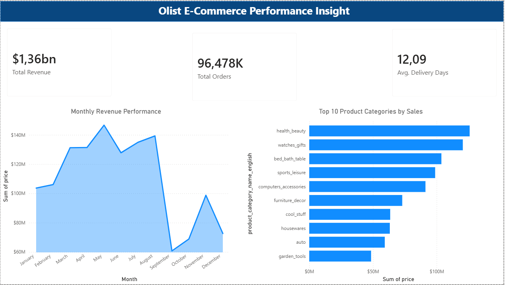

# Olist E-Commerce Performance Dashboard

## 📊 Business Overview
This project transforms a complex, raw e-commerce dataset from Brazil (Olist) into a polished, high-end executive analytics application. The design prioritizes minimal, high-contrast UI/UX structures that allow stakeholders to extract immediate commercial insights regarding revenue trends, volume, and operational delivery times.

## 📱 Interactive Interface Preview

---

## 🛠️ Data Engineering & Problem Solving

A significant portion of this project involved advanced data preparation inside Power Query to transition raw database exports into clean, reporting-ready structures:

* **Localization & Locale Rectification:** The original data source utilized Brazilian formatting rules (commas as decimal points). Directly changing types threw systemic errors. This was resolved by implementing advanced type conversions using the **Portuguese (Brazil) Locale** across core financial columns (`price` and `freight_value`).
* **Cross-Language Query Merging:** To eliminate technical database category keys, a robust merge query operation was implemented to map Portuguese fields (`beleza_saude`) directly to their corresponding English strings (`health_beauty`), improving corporate readability.
* **Metric Engineering:** Built custom temporal logic calculations using Power Query to establish functional business pillars:
  * `Actual_Delivery_Days`: Tracking exact duration from order purchase timestamp to customer delivery.
  * `Estimated_vs_Actual_Days`: Identifying supply chain bottlenecks by calculating whether shipments arrived ahead of or behind schedule.

---

## 🎨 UI/UX & Design Philosophy
Instead of building a cluttered layout, this canvas layout leverages a professional **Minimalist Web App Pattern**:
* **Visual Hierarchy:** High-level executive KPI cards sit on a clean white-on-gray elevated grid directly underneath a striking corporate banner.
* **Cognitive Load Reduction:** Axis titles and database-specific field naming conventions were entirely removed or renamed to focus entirely on clean data storytelling.
* **Clutter Mitigation:** Implemented a targeted `Top N` filter layout on the primary product category axis to limit clutter while instantly surfacing top performance drivers.
